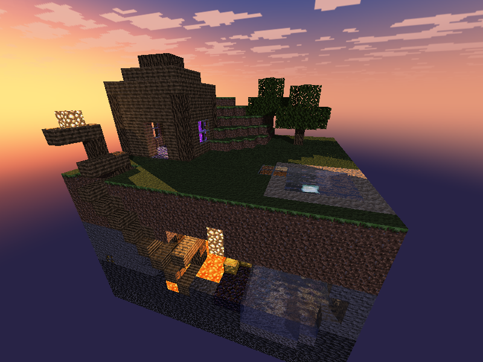
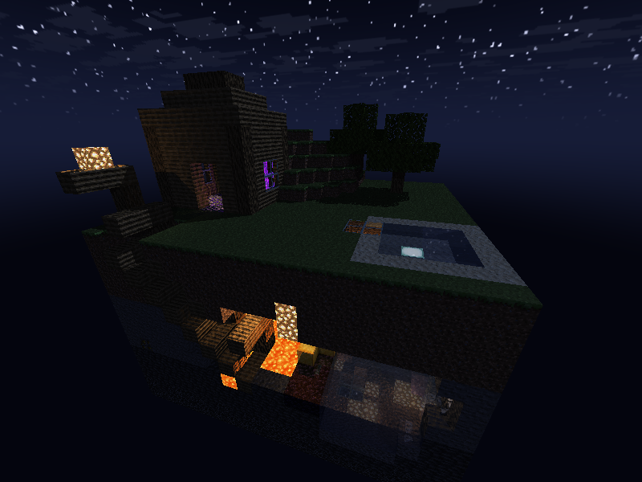
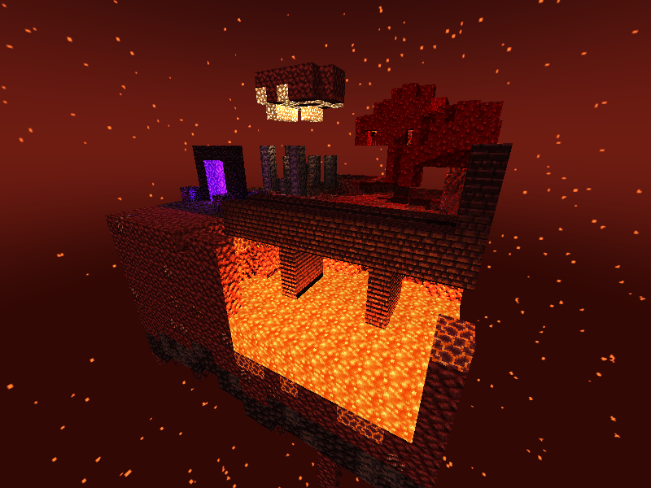
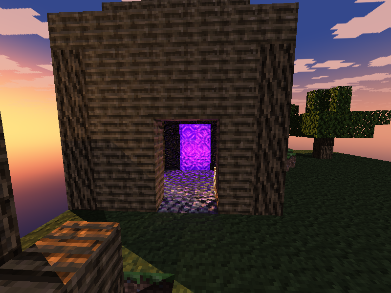
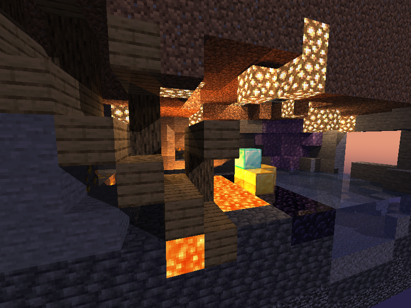
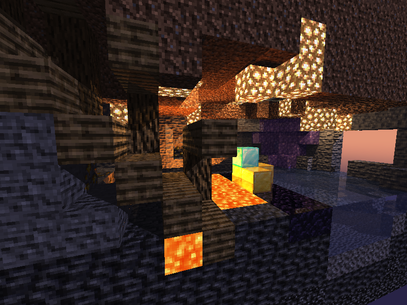
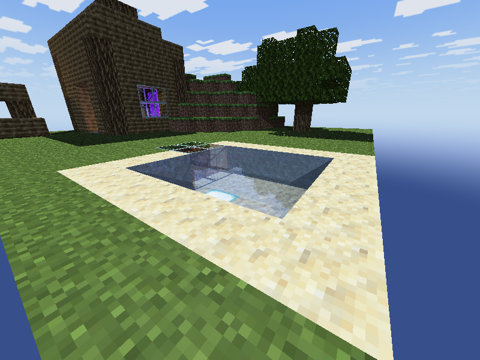
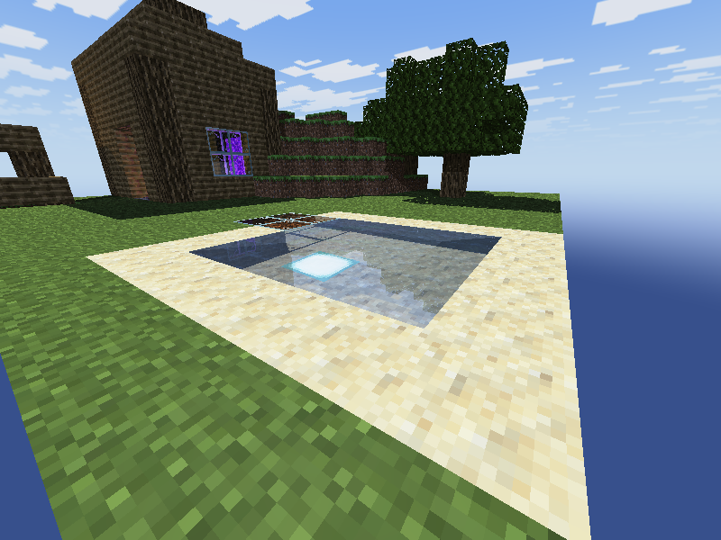

# Diorama de Minecraft con raytracing en Rust

Un raytracer escrito desde cero en Rust, **sin ninguna librería externa**, que renderiza un
diorama de Minecraft hecho de cubos texturizados: una isla flotante con una mina adentro,
cortada por el frente para ver el interior, y un portal en la cabaña del minero que lleva a una
segunda isla en el Nether.

Todo corre en el procesador (sin tarjeta de video), en paralelo entre todos sus núcleos.

## Video

<!-- Para que el video se reproduzca aquí mismo: en GitHub, editar este README, arrastrar
     video/diorama.mp4 debajo de este comentario y guardar. GitHub lo sube y deja un enlace
     que se muestra como reproductor. -->

**[Ver el video (video/diorama.mp4)](video/diorama.mp4)**

El video recorre la mina al atardecer, un acercamiento y alejamiento (zoom), el corte con la
lava y los minerales, las comparaciones con y sin mapas normales y con y sin refracción, la
noche y el día, y el viaje por el portal hasta el Nether. Cada efecto aparece con un subtítulo. Está en [`video/diorama.mp4`](video/diorama.mp4).

## Capturas

| Mina al atardecer | Mina de noche |
|---|---|
|  |  |

| El Nether | El portal en la cabaña |
|---|---|
|  |  |

| Sin mapas normales | Con mapas normales |
|---|---|
|  |  |

| Sin refracción | Con refracción (agua, índice 1.33) |
|---|---|
|  |  |

Con refracción, el fondo del estanque y la linterna marina se ven levantados, como al mirar una
piscina.

## Cómo ejecutarlo

Requiere Rust y Windows (la ventana usa la API de Win32 directamente).

```sh
cargo run --release
```

| Tecla | Acción |
|---|---|
| Flechas / arrastrar con el mouse | Rotar la cámara alrededor del diorama |
| W / S / rueda del mouse | Acercar / alejar |
| R | Rotación automática |
| T | Cambiar la hora en la mina: atardecer, noche, día |
| P | Cruzar el portal (ida y vuelta entre la mina y el Nether) |
| N | Prender / apagar los mapas normales |
| Esc | Salir |

Opciones de línea de comandos:

| Opción | Qué hace |
|---|---|
| `--captura` | Renderiza un cuadro a `output.png` sin abrir la ventana |
| `--bench` | Mide los milisegundos por cuadro mientras la cámara da una vuelta |
| `--nether`, `--noche`, `--dia`, `--sin-normales` | Empiezan en ese mundo, esa hora o sin mapas normales (se combinan con las anteriores) |
| `--sin-refraccion` | Con `--captura`: la luz atraviesa el agua y el vidrio sin doblarse, para comparar |
| `--viaje` | Guarda cuadros del viaje por el portal (`viaje_NN.png`) |
| `--grabar` | Escribe el video del recorrido como pixeles crudos a la salida estándar |

El video se arma pasando esa salida a ffmpeg (un programa aparte, no una librería del proyecto):

```sh
cargo run --release -- --grabar | ffmpeg -f rawvideo -pix_fmt rgb24 -s 1280x720 -r 30 -i - \
    -c:v libx264 -pix_fmt yuv420p video/diorama.mp4
```

## La escena

**La mina** (`src/diorama.rs`) es una isla de 20 × 20 bloques con 5364 bloques en total:

- **Superficie:** pasto, una colina, dos robles, un estanque con orilla de arena y una linterna
  marina en el fondo, un tragaluz de vidrio sobre la caverna, la entrada de la mina con su
  marco de madera y la cabaña del minero, con ventanas de vidrio y el portal al Nether.
- **Corte frontal:** un túnel en escalera con piso de tablones y soportes de madera.
- **Caverna:** glowstone colgando del techo, lava y agua en el fondo con obsidiana donde se
  juntan, un alijo de oro y diamante, y una geoda de amatista.
- **Capas:** tierra, piedra con carbón, hierro y oro, deepslate con oro y diamante, y bedrock.

**El Nether** (`src/nether.rs`) tiene un lago de lava con orilla de magma cruzado por un puente
de fortaleza, un bosque carmesí con hongos gigantes y shroomlight, un valle de arena de almas
con pilares de basalto, el portal de llegada con obsidiana llorona, glowstone colgando de una
roca flotante y estalactitas bajo la isla.

La forma de la caverna, las vetas de mineral y el terreno salen de un ruido determinista propio,
así que la escena es siempre la misma pero no se ve hecha a mano.

## Cómo se cumple cada punto de la rúbrica

| Criterio | Dónde se ve |
|---|---|
| Rotación y zoom | Cámara orbital con mouse, flechas y rueda; rotación automática con R |
| Materiales (más de 5) | 41 bloques distintos, cada uno con su textura y sus propios parámetros (tabla abajo) |
| Refracción | Agua (índice 1.33) del estanque y la caverna, vidrio (1.5) del tragaluz y las ventanas |
| Reflexión | Oro, diamante, obsidiana, amatista, obsidiana llorona y el agua |
| Mapas normales | Piedra, minerales, deepslate, madera, netherrack, etc. El vidrio y el agua quedan lisos para que la refracción se vea clara. Tecla N para comparar |
| Material emisivo | Lava, glowstone, linterna marina, portal, shroomlight, magma, obsidiana llorona. Además de brillar, iluminan lo que tienen cerca |
| Skybox | Cubemap generado con el sol, la luna, las nubes y las estrellas de Minecraft; niebla roja con ceniza en el Nether |
| Programación paralela y optimización | Ver la sección de optimización |

## Materiales

Las texturas son las originales de Minecraft (16 × 16 pixeles), leídas con un decodificador PNG
propio. Algunos de los bloques con sus parámetros:

| Bloque | Albedo (difuso, especular) | Specular | Transparencia | Reflectividad | Refracción | Emisión | Relieve |
|---|---|---|---|---|---|---|---|
| Pasto | 0.95, 0.05 | 8 | 0 | 0 | — | 0 | 0.8 |
| Piedra | 0.9, 0.1 | 20 | 0 | 0 | — | 0 | 2.5 |
| Tablones | 0.85, 0.15 | 25 | 0 | 0 | — | 0 | 2.0 |
| Vidrio | 0.8, 0.6 | 150 | 0.9 | 0.1 | 1.5 | 0 | — |
| Agua | 0.35, 0.5 | 90 | 0.7 | 0.2 | 1.33 | 0 | — |
| Oro | 0.7, 0.8 | 120 | 0 | 0.25 | — | 0 | 2.0 |
| Diamante | 0.7, 0.6 | 250 | 0 | 0.3 | — | 0 | 2.0 |
| Obsidiana | 0.8, 0.7 | 400 | 0 | 0.2 | — | 0 | 2.0 |
| Amatista | 0.75, 0.6 | 180 | 0 | 0.2 | — | 0 | 1.5 |
| Glowstone | 0.4, 0.0 | 32 | 0 | 0 | — | 0.9 | — |
| Lava | 0.3, 0.15 | 30 | 0 | 0 | — | 1.1 | — |
| Portal del Nether | 0.6, 0.3 | 60 | 0.55 | 0 | 1.0 | 0.8 | — |
| Netherrack | 0.95, 0.05 | 10 | 0 | 0 | — | 0 | 2.5 |
| Obsidiana llorona | 0.7, 0.6 | 300 | 0 | 0.15 | — | 0.35 | — |

La lista completa está en `src/blocks.rs`.

## Sin librerías externas

`Cargo.toml` no tiene dependencias. Todo está hecho con la biblioteca estándar de Rust:

| Qué | Dónde |
|---|---|
| Vectores (`Vec3`, producto punto y cruz) | `src/math.rs` |
| Descompresor deflate (para leer PNG) | `src/inflate.rs` |
| Lector PNG (paleta, gris, RGB, RGBA, 1 a 16 bits) y escritor PNG | `src/image_io.rs` |
| Ventana, teclado y mouse con la API de Win32 | `src/window.rs` |
| Hilos para el render en paralelo | `src/render.rs` |
| Fuente de pixeles para los subtítulos | `src/texto.rs` |

## Programación paralela y optimización

Medido en modo `release` a 800 × 600 en un procesador de 12 hilos (`cargo run --release -- --bench`):

| Versión | Bloques | ms por cuadro |
|---|---|---|
| Primera versión: cada rayo prueba contra cada cubo | 101 | 197 |
| Mina actual con todas las optimizaciones | 5364 | 16 – 18 |
| Nether actual | 4117 | 19 |

- **Render en paralelo:** los pixeles se reparten entre todos los núcleos con
  `std::thread::scope`. Cada hilo toma la siguiente franja de filas libre, así los hilos que
  caen en zonas caras (vidrio, agua) no dejan a los demás esperando.
- **Grilla de vóxeles con DDA (Amanatides-Woo):** el mundo es una matriz 3D donde cada bloque
  ocupa un byte. El rayo recorre solo las celdas que atraviesa, así que el costo depende de la
  distancia, no de cuántos bloques hay. Un test compara 500 rayos al azar contra la fuerza bruta.
- **Luces agrupadas:** los bloques emisivos iguales y cercanos se juntan en una sola luz, y los
  enterrados se ignoran. El Nether tiene 42 luces en vez de cientos.
- **Alcance de las luces:** las luces de bloque se apagan del todo a cierta distancia; fuera de
  ese alcance no se calculan ni se lanza su rayo de sombra.
- **Skybox precalculado:** las 6 caras del cielo se generan una vez al arrancar (una por hilo);
  leer el cielo es solo buscar un pixel.
- **Resolución adaptativa:** mientras la cámara se mueve se dibuja con pixeles de 2 × 2 y al
  soltar se dibuja el cuadro completo.
- **Base de la cámara por cuadro:** los ejes de la cámara se calculan una vez por cuadro y no
  una vez por pixel.

## Estructura del código

| Archivo | Qué hace |
|---|---|
| `main.rs` | Ventana, controles y opciones de línea de comandos |
| `render.rs` | Lanzar rayos: luz difusa y especular, sombras, reflexión, refracción, emisión |
| `voxel.rs` | Grilla de vóxeles y su recorrido DDA |
| `cube.rs` | Caras de un bloque: normal, coordenadas de textura y tangentes |
| `blocks.rs` | Los materiales de cada bloque |
| `texture.rs`, `normal_map.rs` | Texturas por cara y mapas normales generados de ellas |
| `light.rs`, `color.rs` | Luces con alcance y color con rango extendido (HDR) |
| `skybox.rs` | Cielos de día, atardecer, noche y Nether |
| `diorama.rs`, `nether.rs`, `scene.rs` | Las dos islas, sus luces y sus horarios |
| `viaje.rs` | Animación del viaje por el portal |
| `grabacion.rs` | Guion del video |

`cargo test` corre 98 pruebas.

## Créditos

Las texturas de los bloques, el sol, la luna y las nubes son de Minecraft, © Mojang Studios,
usadas con fines educativos.
